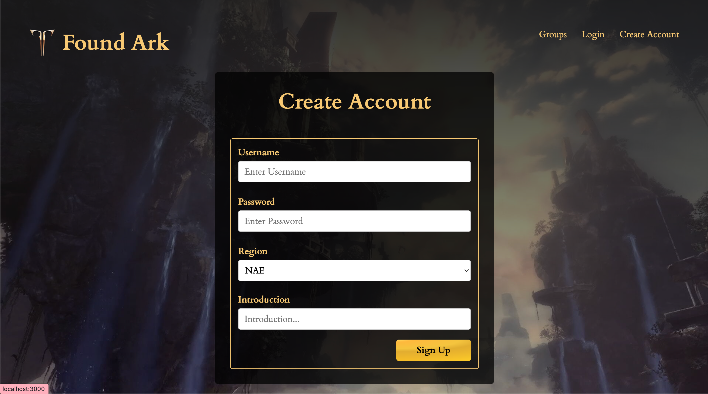
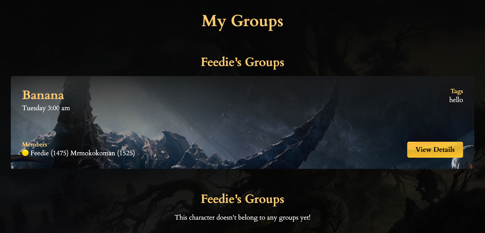
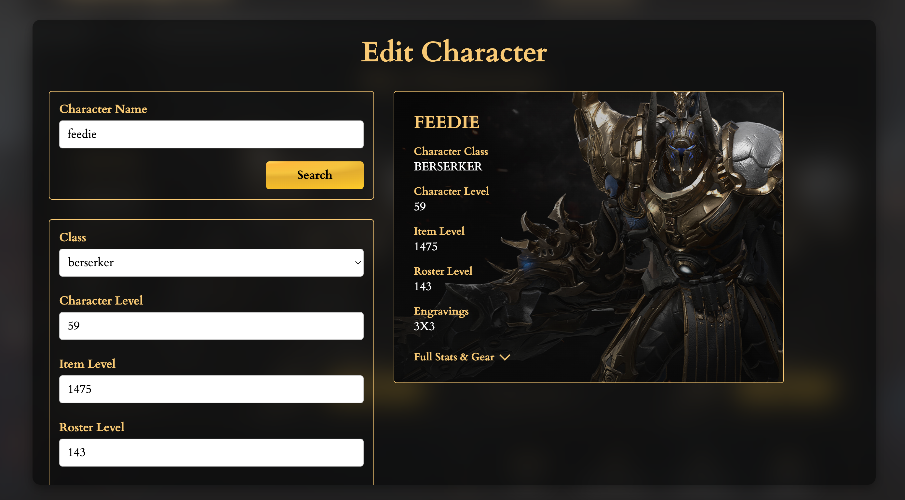
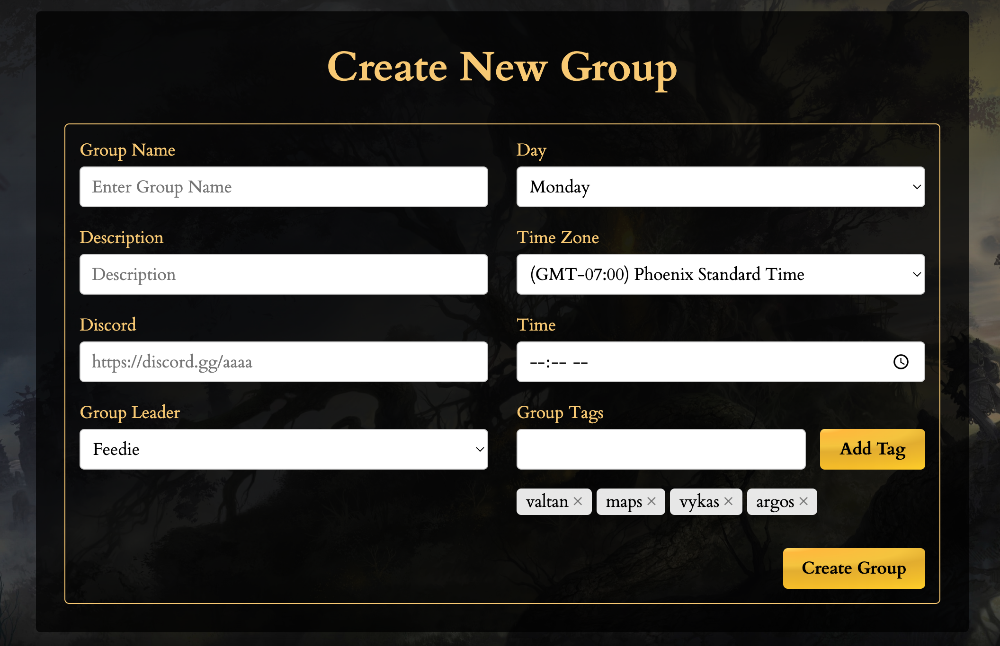
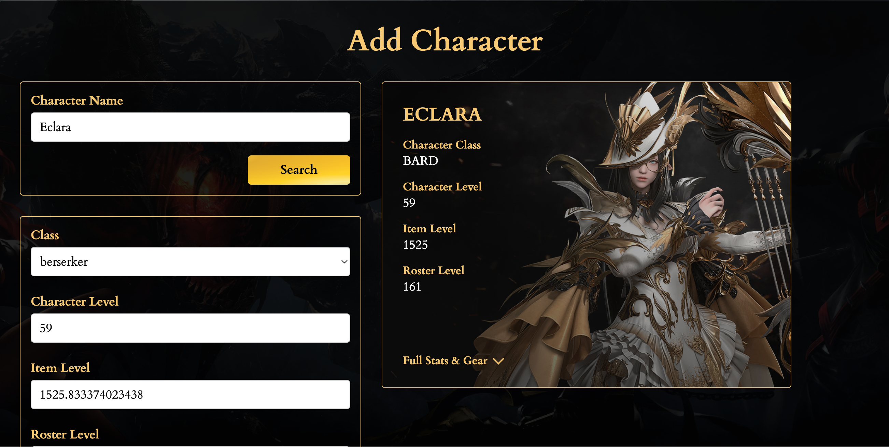
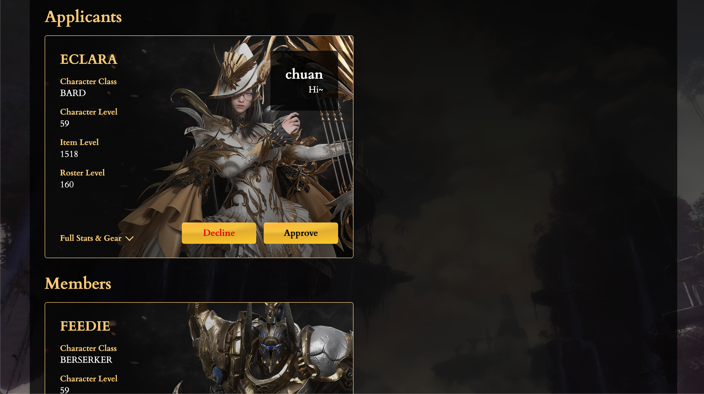
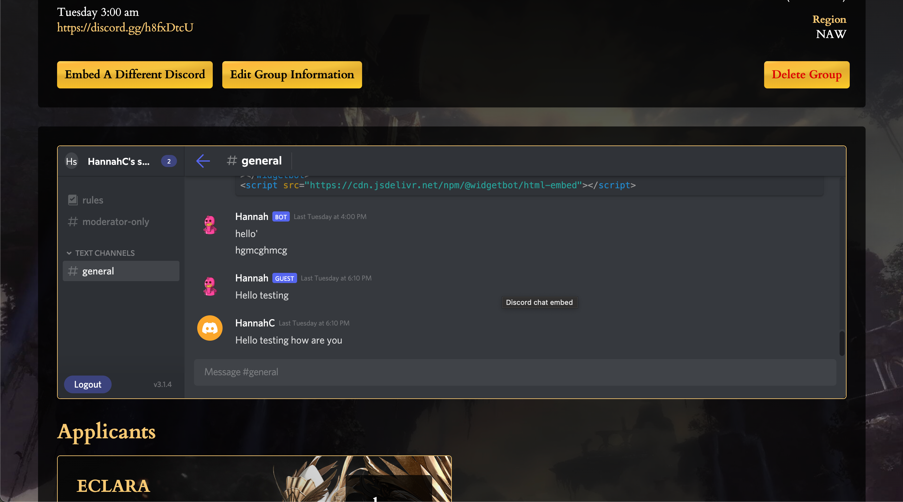
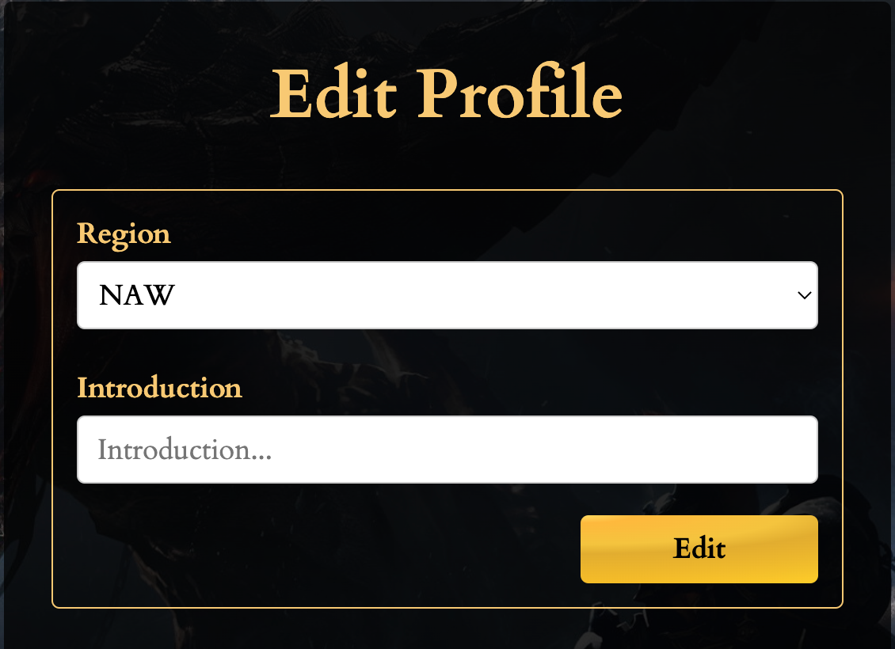

# Final Project: Found Ark

## License


## Table of Contents
- [Final Project: Found Ark](#final-project-found-ark)
  - [License](#license)
  - [Table of Contents](#table-of-contents)
  - [Technologies](#technologies)
  - [Description](#description)
  - [Contributors](#contributors)
  - [Presentation](#presentation)
  - [User Story](#user-story)
  - [Deployed Link](#deployed-link)
  - [Screenshots](#screenshots)
  - [Installation](#installation)
  - [Learn More about React Apps](#learn-more-about-react-apps)
  - [Reach out to us if you have any questions:](#reach-out-to-us-if-you-have-any-questions)

## Technologies

- React: Embed, Route, Dom, AutoComplete, Scripts
- HTML, CSS
- Node
- Express
- Socket.io
- MySQL
- RESTful Routes, CRUD actions
- JWT Tokens
- WidgetBot
- Axios
- Validator
- Moment

## Description

Found Ark is a web application that users can use to find and create groups for raids on the game Lost Ark. We make it easier for players to develop consistent game play groups and discover new ones to join without having to rely on a giant anonymous server where they may never get picked up. Users can import their gameplay characters and use their stats to apply for groups by signing up for Found Ark. Users can also create groups if they don’t find the one the raid they are looking for. Group leaders can reject or accept applications and kick group members out to construct their perfect group! Have fun raiding and farming!

## Contributors

[Eli Wood - Project Manager](https://github.com/MrEliWood)
<br>
[Chuan Wang - Git Administrator](https://github.com/chuanw101)
<br>
[Hannah Callison - Project Team Member](https://github.com/hannahcallison)

## Presentation

[Project 3 Presentation](https://docs.google.com/presentation/d/1NXK11FdoPJut3aMADcWJPN4QUTZq5fXoIUo3dQ_YX0E/edit?usp=sharing)

## User Story

```md
As a user, I want to have a website where I can create and join groups for raids in the Lost Ark game...
So that I can have an easy and fast way to join campaigns

When I open the website, then I am presented with active groups...
When I create an account or login, then I can view the groups I belong to, create a new group, or apply to a new group, I can also add my characters to my profile...
When I go to my profile, then I can view my characters and their stats, I can add new characters to my account, I can update my characters information, and I can edit my characters information...
When I go to my profile and click edit profile, then I can also edit my region and introduction... 
When I add a new character, then I can search for an existing character or I can create a character manually...
When I click the update icon on my characters card, then the database pulls the most updated information and updates the card with any changes...
When I click the edit character button, then I can manually update my characters information... 
When I click Groups, then I am taken to the homepage that displays all of the groups in that region and a search bar...
When I search for tags in the search bar, then I see all of the groups with those active tags...
When I click on the active tags, then they become deactivated and don't filter anymore...
When I click on an inactive tag, then it becomes active and filters groups with that tag...
When I click My Groups, then I am taken to a page that populates the groups I belong to and own... 
When I click All Groups, then I can see all of the groups that belong to that region and can apply to a group I dont belong to...
When I apply to a group, then the database auto sends my character stats to the group leader to approve or deny...
When I am accepted into a group, then I can view the group page and interact with their discord widget or use their discord link and stats...
When I click Create New Group then I cna  create a group, I am asked to fill out information about my teams name, description, time, time zone, discord info, and relevant tags..
When I am on a group page that I own, then I can change the embedded discord server, or group information, I can also permanantly delete my group...
When I am a group leader, then I can accept or reject incoming applications, I can also kick group members out of the group...
When I click the notification button, I am shown groups that have accepted or rejected my application, I can also see who is trying to apply to groups I own...

When I click the logout I am logged out
```

## Deployed Link
[Deployed Found Ark Link](https://found-ark.herokuapp.com/)

## Screenshots

Login             |  Create Account
:-------------------------:|:-------------------------:
|

All Groups             |  My Groups
:-------------------------:|:-------------------------:
|

My Characters             |  Edit Character
:-------------------------:|:-------------------------:
|

Create Group             |  Add Character
:-------------------------:|:-------------------------:
|

Applicants             |  Discord Widget
:-------------------------:|:-------------------------:
|

Edit Profile             |  Group View if user does not belong
:-------------------------:|:-------------------------:
|


## Installation

The deployed link is active and interactive. If a user wants to run this program on their local host, they need to run the command ``` npm i ``` in their integrated terminal. When the installation is complete they can run the command ``` npm run start ``` to open and run the site in their local host.

## Learn More about React Apps

You can learn more in the [Create React App documentation](https://facebook.github.io/create-react-app/docs/getting-started).

<br>

## Reach out to us if you have any questions:
 [foundark.groupfinder@gmail.com](mailto:foundark.groupfinder@gmail.com)